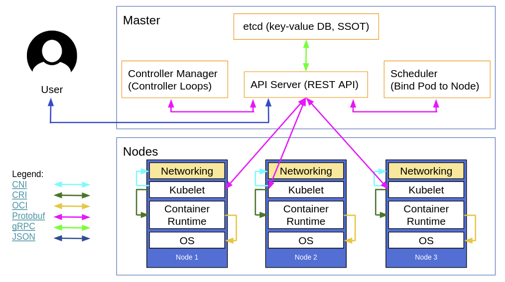

# K8S Architecture #

Kubernetes is a platform for deploying, scaling and managing container based applications in a secure, resilient manner.  It enables you to abstract away the underlying infrastructure to dynamically scale and deploy your containerized applications. Through specifying your "desired state" (within manifests), the K8S control plane works behind the scenes to ensure the current state of your application meets the desired state.  It does so even in the event of your application crashing or if there is a hardware failure.

 

Diagram by [Lucas Käldström](https://docs.google.com/presentation/d/1Gp-2blk5WExI_QR59EUZdwfO2BWLJqa626mK2ej-huo/edit#slide=id.g1e639c415b_0_56)

A K8S cluster is made up of two primary nodes:
- The master node that hosts the components that make up the K8S control plane (Actually the components can be deployed to separate servers instead of all being deployed to a single master server e.g. deploy etcd to its own cluster for security and HA reasons.)
- The worker node (or agent node or minions) that hosts your applications.

For HA, you should have multiple (odd number) of Masters.  You have as many worker nodes as needed for your system(s).

The master node has the following components:

* [API Server](https://kubernetes.io/docs/reference/generated/kube-apiserver/) (K8S is fundamentally API driven).  All cluster management capabilities are accessed through the API server.
* [Controller Manager](https://kubernetes.io/docs/reference/generated/kube-controller-manager/) (manages multiple controllers that ensures the current state of resources match the configured desired state).
* The [Scheduler](https://kubernetes.io/docs/reference/generated/kube-scheduler/)  that is responsible for scheduling pods (your containerized application components) onto the worker nodes.
* The cluster state store which stores all durable state required by the K8S control plane.  State required for service discovery and cluster management is stored in this store. [etcd](https://coreos.com/etcd/) by CoreOS is an example of a highly available distributed state store that is widely used in K8S, another is [Consul](https://www.consul.io/) by Hashicorp.  NOTE: It is common to deploy the state store on a separate physical node for HA and security reasons.

The worker nodes has the following components:

* [kubelet](https://kubernetes.io/docs/reference/generated/kubelet/) - an agent that communicates with the K8S control plane to carry out actions on behalf of the contoller managers.  It is the kubelet that deploys your containers (within pods) onto the worker nodes.  The kubelet is also responsible for controlling the lifecycle of your pods.
* [kubeproxy](https://kubernetes.io/docs/reference/generated/kube-proxy/) - a component that routes requests to services to the correct pods. This service plays a key role in service discovery.  It programs local ```iptable``` rules to capture requests to service IPs and routes to the proper pods.  The service IPs are looked through a DNS service that is deployed on the cluster.
* Container runtime - docker or rkt required to deploy your containers.

## Kubernetes Resources ##

When you work with Kubernetes, you need to be aware of its core resources that model the runtime behaviour of the cluster and your deployed application.  There are resources such as Pods, Deployments, Services, PersistentVolumes, Ingress, Roles, etc that are defined in JSON and YAML format - actually JSON but you define these resources in YAML and it is converted to JSON before they are sent to the API server. These resources are exposed to you through the API Server so that you can perform create, update, delete, list, watch and other operations.  For organization and versioning purposes, the resources are organized into API groups (see the [API Reference](https://v1-8.docs.kubernetes.io/docs/api-reference/v1.8/)).

*Tip: To understand what objects, names, values are valid within a resource manifest, get familiar with navigating the API reference docs.*

*Tip: Learn how to use kubectl explain command.*

To interact with the API server, you have multiple options:

* kubectl - the primary CLI tool
* Your own client as the API Server exposes REST APIs
* 3rd party tools such as [Helm](https://github.com/kubernetes/helm)
* Kubernetes Dashboard - the UI that provides runtime view of the cluster such as deployed resources, CPU, memory stats etc. It uses the API Server to retrieve the data it displays.

**Bottomline - in order to configure, secure, deploy, scale your application components on K8S, you need to work with resources.**

## Controllers ##

The resources describe your desired state, the controllers work to make the desired state the current state - continuously.  There are multiple controllers that manage ReplicaSets, Deployments, and more.  They are essentially control loops that continuously watch for changes in resources and then carries out the necessary actions to put the cluster into a desired state.  This is key to K8S providing self-healing capabilities.

## References ##

* [Excellent community docs on K8S architecture](https://github.com/kubernetes/community/blob/master/contributors/design-proposals/architecture/architecture.md)
* [Large-scale cluster management at Google with Borg](https://research.google.com/pubs/pub43438.html)
* [12 Factor Application Principles](https://12factor.net/)
* [K8S API Reference](https://v1-8.docs.kubernetes.io/docs/api-reference/v1.8/)
* [CNCF Cloud Native Landscape](https://landscape.cncf.io/)