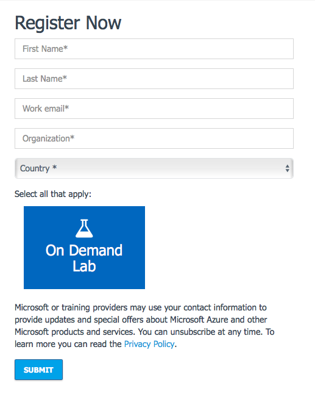
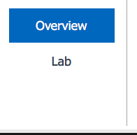
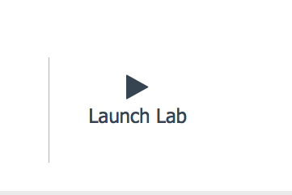
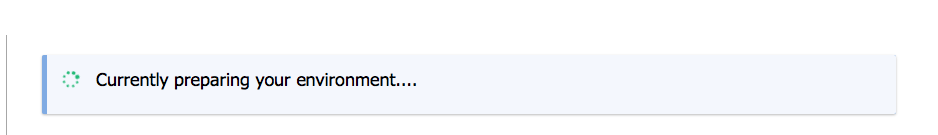
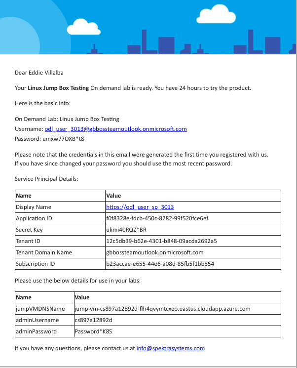
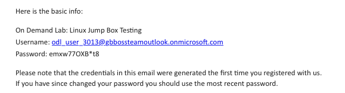

# Setting up your environment #

For the Hackfest, you will be provided an Azure subscription that has all the necessary tooling installed but you will have to provision an AKS cluster.

1. Using your browser go to the Registration Site listed in your classroom.
    * Please make sure you use a valid work email as it will not allow for commercial e-mail domains.
        * 
    * Once you select submit, **DO NOT CLOSE THE BROWSER**.
    * On the Lab and Overview page, navigate to the Lab tab and then select Launch Lab
        * 
        * 
    * The Lab will begin to deploy. **DO NOT CLOSE THE BROWSER**. This will take some time but the needed credentials will be presented on the page when the provisioning is complete.
        * 
    * Your credentials will be emails to your signup email address as well as presented on the screen
        * 

2. Launch your RDP client of choice and enter the url of the jump-box provided for you. Use the AdminUsername and AdminPassword provided in your email
    *  
    * It may take a minute or so at first launch to get the desktop to present. This is normal at first log in.

3. Access Terminal verify
    * Access the Terminal application on your VM desktop. Applications -> Favorites -> Terminal
    * Verify az, kubectl, and helm are installed

```sh
az --version
kubectl version
helm version
```

4. Log in to your student Azure account via the az CLI
    * Use ``az login`` to login to your lab Azure Account. You will be asked to visit ``https://aka.ms/devicelogin`` and use the provided code to authenticate. Use the credentials provided in your e-mail/Lab Provisioning page.
        *    
    * The password is a onetime password and must be changed at first signing in.
    * Your terminal windows will update with a JSON output of your subscription confirming the login has worked.

5. Provision a AKS cluster using your first initial + last name + k8shackfest for the clustername

```sh
az aks create -n firstinitiallastname-k8shackfest -g <your resource group name> -c 2 -k "1.8.1" --generate-ssh-keys

#list your AKS cluster
az aks list -o table

#The result will be a table with your AKS cluster name, location, ResourceGroup...
Name         Location       ResourceGroup    KubernetesVersion    ProvisioningState
-----------  -------------  ---------------  -------------------  -------------------
aks-cluster  canadacentral  k8s-hackfest     1.8.1                Succeeded

#Get credentials for your cluster so you can authenticate using kubectl
az aks get-credentials -n <your cluster name> -g <your resource group name>

#verify you can access the cluster
kubectl get nodes

#you should see something like this
NAME                       STATUS    ROLES     AGE       VERSION
aks-nodepool1-30106593-0   Ready     agent     28m       v1.8.1
aks-nodepool1-30106593-1   Ready     agent     28m       v1.8.1

#clone or download the github repo onto the jumpbox environment
git clone https://github.com/jungho/k8s-bootcamp.git
```

## Setting up Minikube ##

This part is only for the RBAC portion of the exercises.  Unfortunately, AKS currently does not support RBAC.  To use RBAC on Azure, you will need to leverage ACS.  The alternative is [ACS Engine](https://github.com/Azure/acs-engine), however, that is an advanced topic so we will be using Minikube to demonstrate RBAC concepts.

See the installation instructions for your OS [here](https://github.com/kubernetes/minikube/releases)

*Use v0.25.0 as it supports K8S 1.9*

*Note for Windows, you need to make a decision if you are going to use Hyper-V or Virtualbox for virtualization.  If you have installed Docker with Hyper-V then you have to choose Hyper-V for Minikube also to support both.*

*Note for Linux, if you have enabled Secure Boot in your BIOS, then you need to sign the virtualbox kernel modules. See this [article](https://askubuntu.com/questions/760671/could-not-load-vboxdrv-after-upgrade-to-ubuntu-16-04-and-i-want-to-keep-secur) The easiest is to just disable Secure Boot.*

Once installed, run the following command to start up Minikube.  This will download the latest release of K8S and start a single node cluster locally.

### Enabling RBAC on Minikube ###

- Start up minikube with the options to enable RBAC on the api-server.

```sh
minikube start --extra-config=apiserver.Authorization.Mode=RBAC

# required to get the kube-dns and dashboard pods to run
# See https://github.com/kubernetes/minikube/issues/1734
kubectl create -f minikube-rbac-privileges.yml
```

To stop minikube and bring down the cluster:

```sh
minikube stop
```

Some useful minikube commands:

```sh
#to get the IP to your minikube master
minikube ip

#to get the URL of a service deployed to minikube
minikube service <service-name>

#to get the URL for all servics
minikube service list

#to ssh into a pod
minikube ssh <pod-name>

#to delete the local K8S VM
minikube delete
```

## Environment Set Up at Home ##

You will be using the AKS environment set up for you by Microsoft.  However, if you want to work with your own cluster, below are instructions to set up your local dev environment, and also provision an ACS cluster.

You will need the following tools installed:

* Azure cli
* docker (only if you will be building docker images locally)
* Helm
* kubectl
* Visual Studio Code

## Installing Azure CLI ##

Install the latest version of azure cli for your operating system from [here](https://docs.microsoft.com/en-us/cli/azure/install-azure-cli?view=azure-cli-latest).

## Install Docker ##

Install docker for your operating system.

* For [Windows](https://docs.docker.com/docker-for-windows/install/)
* For [macOS](https://docs.docker.com/docker-for-mac/install/)
* For [Ubuntu](https://docs.docker.com/engine/installation/linux/docker-ce/ubuntu/#docker-ee-customers)

After you have installed docker and the azure cli, run the following commands to ensure they have been installed.

```sh
az --version
docker version
```

## Install Visual Studio Code ##

Download and install VS Code for your OS.  [https://code.visualstudio.com/](https://code.visualstudio.com/)

Install the following extensions (search in the extensions tab):

* Kubernetes Support
* vs-kubernetes
* Docker

These extensions provide syntax highlighting, code snippets and more for working with Docker, Kubernetes and Helm artefacts.

## Verify your Azure subscription ##

Make sure all the required resource providers are registered in your Azure subscription.  As you will be creating network, compute and storage resources on Azure, and you will be using Azure Container Service and Azure Container Service, you need to ensure you have the following providers registered in your Azure subscription:

* Microsoft.Network
* Microsoft.Storage
* Microsoft.Compute
* Microsoft.ContainerService
* Microsoft.ContainerRegistry

To determine which providers are registered run this command:

```sh
#login to your Azure subscription
az login

#list your registered providers
az provider list -o table | less
```

The registration state of each of the providers above should be 'Registered'.  If not, you need to register the provider using the following command:

```sh
az provider register -n <provider>
```

For example,

```sh
az provider register -n Microsoft.ContainerService
```

## Create a K8S cluster on Azure and install kubectl ##

*THIS IS ONLY FOR AZURE CONTAINER SERVICE.  For managed kubernetes e.g. AKS see [Azure Kubernetes Service](https://docs.microsoft.com/en-ca/azure/aks/intro-kubernetes).*

After you have verified your subscription has the necessary providers registered, create a test K8S cluster on Azure. To do so, run the following commands (you already have to be logged into Azure via the CLI). Note, I use the resource group name ``k8s-example`` and cluster name ``test-cluster`` but you can name them what you want.

* Create a resource group for your cluster

```sh
az group create -n <rg-name> -l <region>
```

* Create the cluster

```sh
az acs create -n <cluster-name> -g <rg-name> --generate-ssh-keys --master-count 1 --agent-count 1 -t Kubernetes
```

* After the cluster has been successfully created install kubectl

```sh
az acs kubernetes install-cli
```

* Then get the credentials to your K8S cluster.

```sh
#this will download and install the certificates to access your cluster
#in your ~/.kube/config file

az acs kubernetes get-credentials -n <cluster-name> -g <rg-name>
```

* Verify your kubectl installation by listing the nodes in your cluster

```sh
kubectl get nodes
```

* Verify the status of the K8S components

```sh
kubectl get componentstatuses

#you should see something like this...
NAME                 STATUS    MESSAGE              ERROR
controller-manager   Healthy   ok
etcd-0               Healthy   {"health": "true"}
scheduler            Healthy   ok
```

* Start up proxy to tunnel to the Kubernetes Dashboard

```sh
kubectl proxy
```

Open a brower and navigate to ```http://127.0.0.1:8001/ui``` and you will see the dashboard.

## Install Helm ##

To install helm follow the instruction [here](https://github.com/kubernetes/helm/blob/master/docs/install.md).  Note that to install the server side of Helm (tiller), you need the K8S cluster running.  In ACS tiller is installed but you need to upgrade by running:

```sh
helm init --upgrade
```

## Bringing down your cluster ##

In order to not incur Azure costs, you should tear down your cluster when not in use.  At the end of each day just delete the resource group.

```sh
az group delete -n k8s-example
```

## Why AKS, ACS, and ACS Engine? ##

AKS is a new fully managed service that frees you from worrying about managing the underlying VM, storage, and network resources.  With ACS, you are responsible for patching the OS etc, while with AKS you do not need to worry about these operational tasks.  Eventually, AKS will be replacing ACS.

ACS Engine is an open source project that allows you to customize your K8S deployment on Azure.  It generates the ARM (Azure Resource Manager) templates to provision the virtual machines, the storage, network, and then the K8S cluster.  It is much more flexible in terms of K8S features you can enable.  For example, if you need to enable features such as AdvancedAuditing, then you need to use ACS Engine.  However, you are responsible for maintaining ALL the resources and hence you will need to have the processes and skillset to do so.  In a nutshell, you can think of ACS Engine as *IaaS* and AKS as *PaaS* versions of Kubernetes on Azure.

## Next... ##

Go to [Exercise 1](./exercise1.md)

## References ##

* [Kubectl Cheatsheet](https://kubernetes.io/docs/reference/kubectl/cheatsheet/)
* [Kubectl Command Reference](https://kubernetes.io/docs/reference/generated/kubectl/kubectl-commands#-strong-getting-started-strong-)
* [Kubernetes on Azure](https://docs.microsoft.com/en-us/azure/container-service/kubernetes/container-service-intro-kubernetes)
* [Azure Kubernetes Service](https://docs.microsoft.com/en-ca/azure/aks/intro-kubernetes)
* [ACS Engine](https://github.com/Azure/acs-engine)