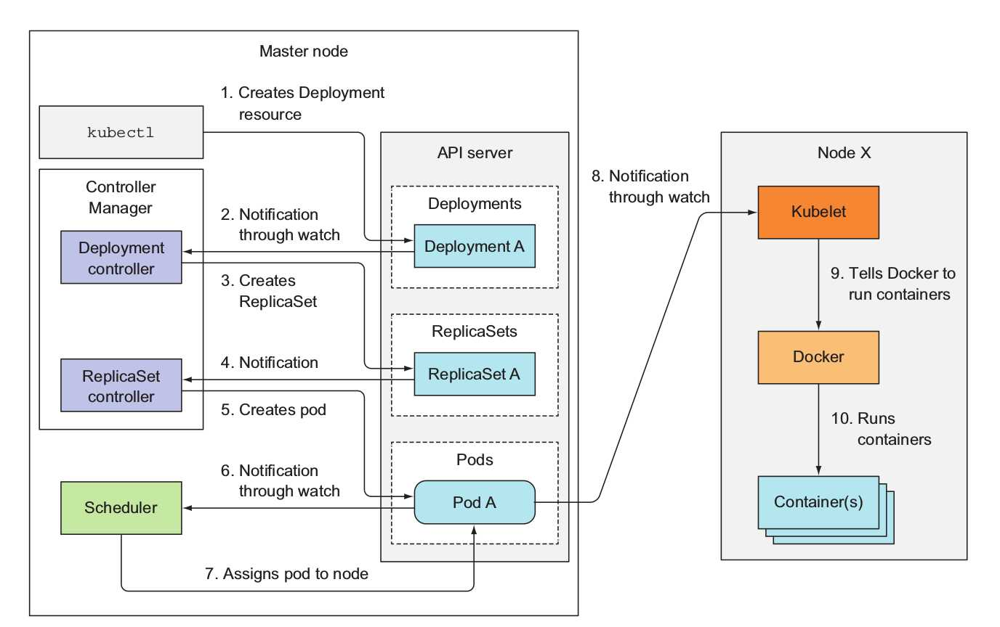

# Deployments #

A key capability of K8S is that it understands your "desired state" as defined in your resource manifests, and it works continuously to ensure that the current state matches the desired state.  Deployments are an excellent example of this capability.  With Deployments you can do the following:

* Define the number of replicas of your pods
* Define the deployment strategy e.g RollingUpdate, Recreate
* Rollout your deployment at a controlled rate e.g. canary deployments
* Check deployment status
* Pause a deployment
* Rollback a deployment

A lot goes on behind the scenes with Deployments.  See the following excellent diagram from the ["Kubernetes in Action"](https://www.manning.com/books/kubernetes-in-action) book by Manning.

A common question is what if you do not need replication?  You should still use deployments as you benefit from resilience, rollback, and [horizontal auto-scaling](./horizontal-pod-autoscaling.md) capabilities.

Note, in previous versions of K8S, you interacted directly with ReplicationControllers and ReplicaSets to manage the replica count of your pods.  With Deployments, you no longer should deal directly with ReplicaSets, in fact, Deployments manages the ReplicaSets for you.

See [Exercise 1](../bootcamp/exercises/exercise1.md) for deployment examples.

## References ##

- [Deployment docs at k8s.io](https://kubernetes.io/docs/concepts/workloads/controllers/deployment/)
