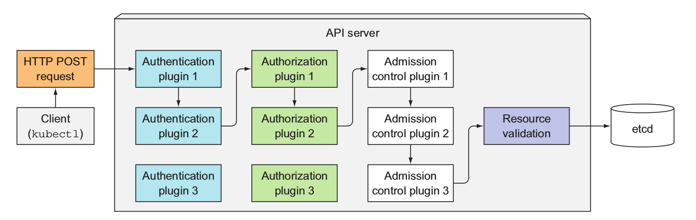

# Security #

Securing your Kubernetes cluster is a large topic.  Here we discuss Kubernetes native means to securing your cluster.  

The primary K8S capabilities for securing your workloads are:

- [RBAC (Role-Based Access Control)](#markdown-header-rbac)
- [Pod Security Policy](#markdown-header-pod-security-policy)
- [Network Security Policy](#markdown-header-network-security-policy)

**Of course, there are many other considerations to securing your cluster depending on how it is deployed. For example, key management, patching your OS, process, and many more.  Here we only cover the main K8S considerations for securing your cluster**

## RBAC ##

If you need to provide other users/roles restricted access to the K8S cluster, for example, you want "QA" roles having read/write access to only their environment, and "Dev" roles having read/write access to only their environment, then RBAC is the means to do so going forward.

### Authentication and Authorization in K8S ###

K8S supports a very flexible authentication/authorization model that is extensible through plugins and modules.  There are different authentication and authorization modules to support different requirements - from simple username/password to x509 certificates to Open ID Connect with an external Identity Provider, and more.

You can configure multiple authentication modules to support different authentication scenarios within your cluster.  Each of the enabled authentication modules will be invoked and short-circuited when the first module authenticates the request.  If all the modules cannot authenticate then access is denied.

Here is an excellent diagram from the [Kubernetes in Action](https://www.manning.com/books/kubernetes-in-action) book from Manning that describes this concept.



See [Controlling access to the K8S API](https://kubernetes.io/docs/admin/accessing-the-api/) to set up HTTP Basic Auth authentication, and see [Azure Active Directory plugin for client authentication with OIDC](https://github.com/kubernetes/client-go/tree/master/plugin/pkg/client/auth/azure) to set up authentication with your Azure AD tenant.

Below we will show setting up authentication and RBAC authorization using x509 certificates.

### Authenticating using x509 certs ###

**MAKE SURE THE PROPER APIVERSION IS SET IN YOUR RESOURCES**

The apiVersion for RBAC has changed since v1.7 as it was still Beta at that time. Make sure you have set the proper version in the following files.

- production-role.yml
- production-rolebinding.yml
- qa-role.yml
- qa-rolebinding.yml

```yaml
#for v1.8.0 and later
apiVersion: rbac.authorization.k8s.io/v1

#for v1.7.x
apiVersion: rbac.authorization.k8s.io/v1beta1
```

Once the proper apiVersion has been set, see scripts to do this in the [certs](./certs) directory.

```sh
#1. Create credentials
openssl genrsa -out user.key 2048
openssl req -new -key user.key -out user.csr -subj "/CN=user/O=organization"
#CLUSTER_CA_LOCATION for minikube would be $HOME/.minikube
openssl x509 -req -in user.csr -CA CLUSTER_CA_LOCATION/ca.crt -CAkey CLUSTER_CA_LOCATION/ca.key -CAcreateserial -out user.crt -days 500

#2.  Create a new cluster/user context for kubectl using the user.crt/key that was just created
kubectl config set-credentials user --client-certificate=./user.crt  --client-key=./user.key
kubectl config set-context user-context --cluster=cluster --user=user

#3.  Set the current context to the user-context
kubectl config use-context user-context

#4.  Now try to do something
kubectl get pods
```

### Finding out what you can do ###

To find what you can do:

```sh
kubectl auth can-i verb resource

#can i create pods?
kubectl auth can-i create pods

#can i create pods in the kube-system namespace
kubectl auth can-i create pods --namespace kube-system

#can i create pods in the kube-system namespace as the default systemaccount user?
kubectl auth can-i get configmaps --namespace kube-system --as system:serviceaccount:kube-system:default
```

### Service Accounts ###

Your Pods can also have identity.  This is necessary if your containers need to access the API server and you want to control what that container process can do via RBAC.  This identity is represented by the ServiceAccount resource.  ServiceAccounts are namespaced resources, hence the full name for a given service account is `system:serviceaccount:NAMESPACE:NAME`.  When the Pod executes, the containers in the Pod executes as the identity represented by the ServiceAccount.  You can bind RBAC permissions to this ServiceAccount - this is relevant when it comes to accessing the API Server; you can also leverage a Kubernetes service called [SubjectAccessReview API](https://kubernetes.io/docs/reference/access-authn-authz/authorization/) to verify whether a given process can access other Kubernetes components (e.g. the kubelet).

By default, each Pod gets a default service account within the namespace it is deployed to.  You can also create you own ServiceAccounts to have more granular control.  When a ServiceAccount is created, regardless of whether it is a default account or custom, this triggers the creation of a secret.  This secret is a token (a JWT token) and it used when accessing the API server.

See [service-account.yaml](./service-account.yaml) for an example of creating a ServiceAccount and using it from a Pod.

## Pod Security Policies ##

PodSecurityPolicy (PSP) resources enable the cluster admin to specify security contraints cluster wide for all pods.  In order for a Pod to be deployed onto the cluster, the pod template must meet the requirements specified in the PSP.  Note the policy is enforced at deployment time, not at runtime.  

See [here](https://kubernetes.io/docs/concepts/policy/pod-security-policy/#what-is-a-pod-security-policy) for examples of what constraints can be specified. 

Note that PSPs are cluster wide resources.  This means the policy applies to all PODs deployed to all namespaces by default.  Clearly such a wide scope would lead to situations that may be overly restrictive in certain cases.  For example, you may want to deploy system-level services that require hostPath or hostNetwork access.  To control which policies are enforced at deployment time, you can leverage RBAC and bind policies to ClusterRoles, then through ClusterRoleBindings, you can control which users can deploy pods with certain capabilities.  For example, you can define policies such that only the admin role can deploy pods that runs as a privileged user, and you can specify a more restrictive default policy that would be applied to all other users.  See [authorizing policies by RBAC](https://kubernetes.io/docs/concepts/policy/pod-security-policy/#via-rbac) for details.

In order to leverage PSPs, it needs to be enabled on the cluster. The quickest way to determine if PSPs are enabled is to run the following command:

```sh
kubectl get psp

#This means PSP is enabled
No resources found.

#This means PSP is not enabled
the server doesn't have a resource type "psp"
```
If PSP is not enabled, you will need to enable the PodSecurityPolicy AdmissionController on your cluster.  This is done by passing an option to the kube-apiserver.  Unfortunately, this is not possible on AKS as you do not have access to the master nodes.  On ACS, the approach is to ssh into the master nodes, and update the kube-apiserver manifest and add the option.  The manifests are located in the `/etc/kubernetes/manifests` directory.  Once the manifest is updated, you need to restart the kubectl with `sudo systemctl restart kubelet`.  

The other alternative is to use [acs-engine](https://github.com/Azure/acs-engine) to create a custom cluster with it enabled.  Note, you also need to enable AppArmor on all your nodes. 

See [restrict-hostport.yaml](./restrict-hostport.yaml) and [restrict-root.yaml](./restrict-root.yaml) for examples.

## Network Security Policies ## 

By default, any pod can communicate with any other pod in the cluster.  However, what about if you wanted so control what pods can communicate with other pods?  What would be the equivalent to Azure [network security groups](https://docs.microsoft.com/en-us/azure/virtual-network/virtual-networks-nsg) in Kubernetes?  That would be [Network Policies](https://kubernetes.io/docs/concepts/services-networking/network-policies/).

Network policies enable you to specify how a group of pods communicate with each other. For example, let's say you want to ensure pods can only communicate with other pods in the same namespace, you can achieve this with network policies.

Here is an example of a Network Policy that prevents ingress access to the database pods from anything except pods with the label `access=true`.  Note, Network Policies are applied at the namespace level.

```yaml
kind: NetworkPolicy
apiVersion: networking.k8s.io/v1
metadata:
  name: db-access
spec:
  #This policy applies to those pods with label 'service=database'
  podSelector:
    matchLabels:
      service: 'database'
  #This is the ingress rule.  It will only allow ingress from those
  #pods that have the label 'access=true'
  ingress:
  - from:
    - podSelector:
        matchLabels:
          access: 'true'
```

From above, you can see that NetworkPolicies are applied to pods within a given namespace (NetworkPolicy is a namespace level resource).  You then apply ingress and egress rules that defines traffic to and from the pods.  The ingress/egress rules can select the soure and destination using podSelectors, namespaceSelectors (e.g. all pods from a given namespace), and ipBlock (e.g. pods part of a given CIDR ip address range).  For details, run `kubectl explain networkpolicy.spec.ingress.from` or `kubectl explain networkpolicy.spec.egress.to`.

See this this [blog post on k8s.io](http://blog.kubernetes.io/2017/10/enforcing-network-policies-in-kubernetes.html) for more info on Network Policies.  See also the excellent [Network Policy Recipes](https://github.com/ahmetb/kubernetes-network-policy-recipes) for some in-depth examples of policies.

### Network Policies on AKS ###

As AKS is a managed Kubernetes service you do not have means of configuring the master nodes beyond the capabilities exposed by az cli e.g. you do not have access to the master nodes directly.  Furthermore, today, AKS supports on the kubenet and Azure CNI network plugins and neither supports network policies.  Support for the Calico plugin is coming but in the meantime, you will need to use [kube-router](https://github.com/cloudnativelabs/kube-router).  Kube-router is an open source project that enables you to enforce network policty without a CNI that supports it.  It is deployed as a Daemonset (hence on every node) and leverages native Linux kernel features.  See this excellent blog for how to get kube-router deployed on AKS.  https://www.techdiction.com/2018/06/02/enforcing-network-policies-using-kube-router-on-aks/

## pod.spec.securityContext ##

The pod specification enables you to set security constraints at the pod level (applies to all containers) and at the container level.  

```sh
#with an active kubectl config run
kubectl explain pods.spec.securityContext

#Or run
kubectl explain pods.spec.containers.securityContext
```

Reviewing your pod spec from the security perspective should be part of your code review!  Here is a tool you can use, https://kubesec.io/, to scan your specification, and it will make recommendations. Very helpful!

## Verifying Your Security Configuration ##

[Aquasec](www.aquasec.io) which provides a very comprehensive security monitoring platform for Kubernetes has opensourced their [kube-bench](https://github.com/aquasecurity/kube-bench) tool.  Kube-bench essentially audits your deployment from a security configuration perspective.  It follows the guidelines defined within the [CIS Kubernetes Benchmark](https://www.cisecurity.org/benchmark/kubernetes/).  A related tool is [kube-hunter](https://github.com/aquasecurity/kube-hunter) that helps identifiy potential security holes within your cluster configuration. Think of it as pen-testing for kubernetes configuration.   These tools can be incorporated into your CI/CD pipeline during development.  For production, I do recommend a tool like Aquasec or Twislock as it provides many more capabilities.

## Bleeding Edge ##

There are multiple opensource projects currently gaining attention that takes different approaches to providing additional security boundaries around containers.  Both integrate with the CRI and hence is transparent to the Kubernetes layer. Definitely keep an eye on these projects.

* https://katacontainers.io/
* https://github.com/google/gvisor

## Reference ##

- [kubernetes-security.info, An amazing security resource for Kubernetes.](https://kubernetes-security.info/)
- [Using RBAC Authorization](https://kubernetes.io/docs/admin/authorization/rbac/)
- [OpenID Connect Auth Flow on Azure AD](https://docs.microsoft.com/en-us/azure/active-directory/develop/active-directory-protocols-openid-connect-code)
- [Integrating AKS and Azure Active Directory](https://docs.microsoft.com/en-us/azure/aks/aad-integration)
- [K8S Authentication with OpenID Connect tokens](https://kubernetes.io/docs/admin/authentication/#openid-connect-tokens)
- [Excellent guide by Bitami](https://docs.bitnami.com/kubernetes/how-to/configure-rbac-in-your-kubernetes-cluster/)
- [CNCF - Effective RBAC Youtube video](https://www.youtube.com/watch?v=Nw1ymxcLIDI)
- [Autogenerating RBAC manifests from K8S audit logs](https://github.com/liggitt/audit2rbac)
- [Excellent guide by Bitami on Pod Security Policies](https://docs.bitnami.com/kubernetes/how-to/secure-kubernetes-cluster-psp/)
- [Encrypting Secrets at Rest](https://kubernetes.io/docs/tasks/administer-cluster/encrypt-data/)
- [Network Security Policy](https://kubernetes.io/docs/tasks/administer-cluster/declare-network-policy/)
- [Building Container Images Securely on Kubernetes](https://blog.jessfraz.com/post/building-container-images-securely-on-kubernetes/)
- [SSO for K8S](https://thenewstack.io/kubernetes-single-sign-one-less-identity/)
- [OICD Helper for K8S](https://github.com/negz/kuberos)

## Interesting Security Related Links ##

- [Jesse Frazelle's blog on K8S multi-tenancy](https://blog.jessfraz.com/post/hard-multi-tenancy-in-kubernetes/)
- [Katacontainers](https://katacontainers.io/) - nested virtualization to increase container isolation. 
- [gVisor](https://github.com/google/gvisor) - userspace kernel abstraction to implement container sandbox. **Not all kernal interfaces are have implemented and therefore, some applications that may not work!!**
- [6 Myths About Container Security](https://www.csoonline.com/article/3272830/containers/fact-vs-fiction-6-myths-about-container-security.html)
- [bane - tool to help create custom AppArmor profiles](https://github.com/genuinetools/bane)
- [Default Linux Capabilities](https://rhelblog.redhat.com/2016/10/17/secure-your-containers-with-this-one-weird-trick/)
- [CIS Kubernetes Benchmark](https://www.cisecurity.org/benchmark/kubernetes/)
- [RBAC-Manager - An operator to simplify managing RBAC through CRDs](https://github.com/reactiveops/rbac-manager)
- [Grafeas - component meta-data API to implement auditing and governance across your software supply chain](https://grafeas.io/)
- [Kelsey Hightower's example of using Dynamic Admission Controllers to integrate with Grafeas to ensure containers are signed with a key before allowing it to be deployed!](https://github.com/kelseyhightower/grafeas-tutorial)