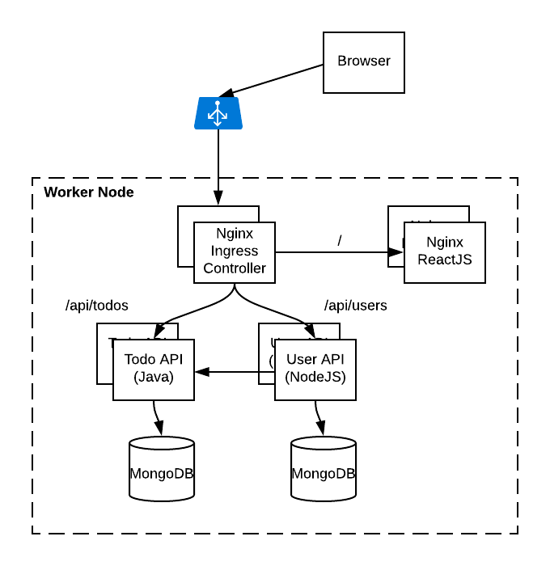

# Todo List Microservice Application #

The Todo application is a simple microservice based application comprised of a ReactJS UI, a node Users API and a Java TodoItem API.  For a database, mongodb is leveraged.  We will use this application to learn about many of the core K8S concepts.

## Manually Deploy the application ##

This is a good exercise to understand what is required to manually deploy a micro-service based application to Kubernetes. See [manual-k8s-deploy/README.md](./manual-k8s-deploy/README.md)

## Deploy the application using Helm ##

As your applications become more complex, you will quickly realize that you will need Helm to package your applications.  See [helm/README.md](../helm/README.md)

# Developers #

To build, test and deploy the application see the Developers [guide](./DEV-README.md).